# Alabama GRIDMET vs NLDAS3 Comparison Report

## Indicator Definitions and Method

- **Growing Degree Days (GDD)**: calculated from daily mean temperature using base threshold **10 deg C**.
  Contribution per day is `max(((Tmax + Tmin)/2 - 10), 0)`. Monthly GDD is the sum of daily contributions.
- **Heat Stress Days (HSD)**: count of days where **Tmax > 30 deg C**.
- **Frost-Free Days**: count of days where **Tmin > 0 deg C**. (Related indicator in this workflow is frost days with threshold **Tmin < 0 deg C**.)
- **Climatology period**: **2016-2025** (10 years).
- **GRIDMET data access**: Google Earth Engine.
- **NLDAS-3 data access**: AWS S3.

## FROST_DAYS Mean Maps

Representative monthly mean maps (Months Jan, April, July, Oct):

### Month Jan
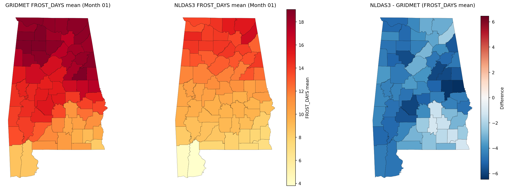

### Month April
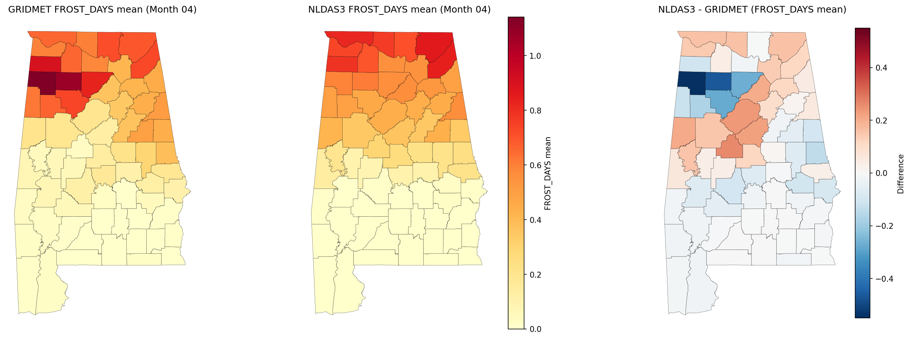

### Month July

### Month Oct
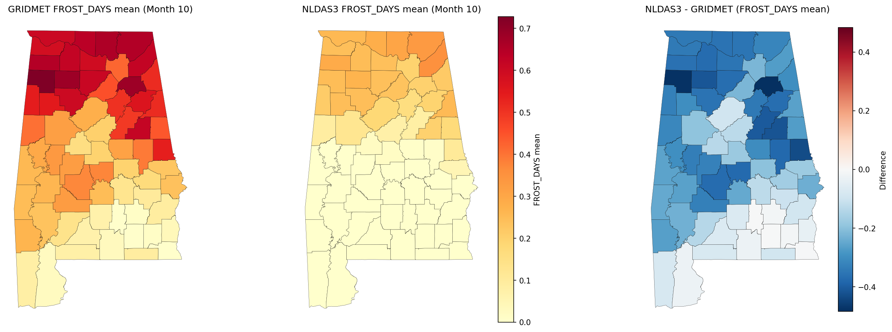

## FROST_DAYS Distribution Plots

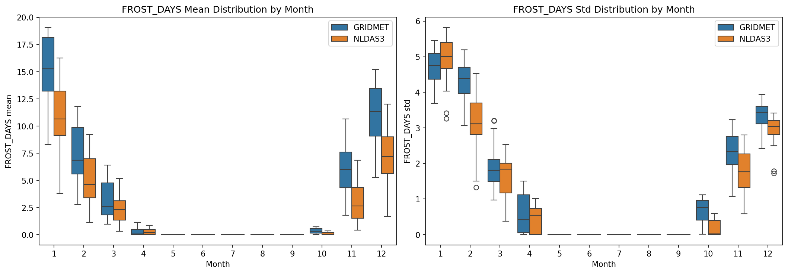

## GDD Mean Maps

Representative monthly mean maps (months 01, 04, 07, 10):

### Month Jan
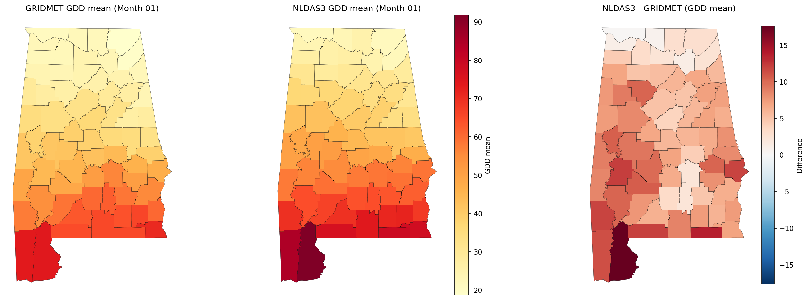

### Month April
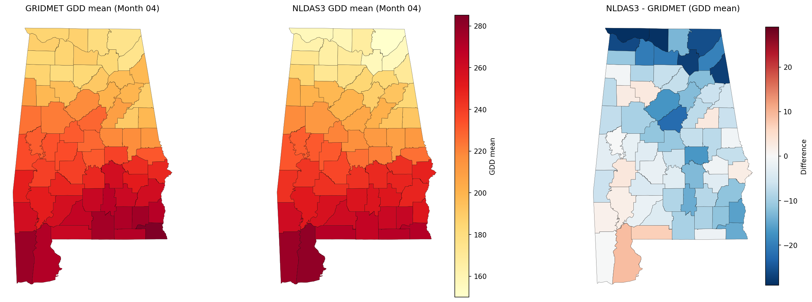

### Month July
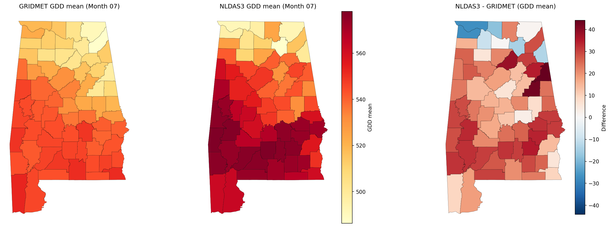

### Month Oct
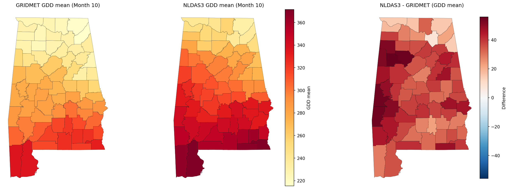

## GDD Distribution Plots

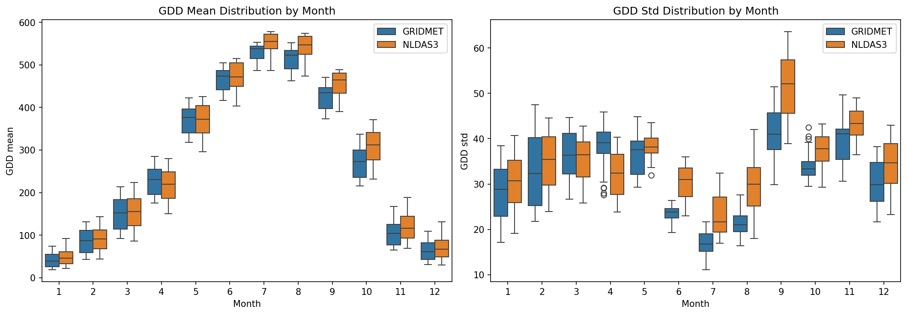

## HSD Mean Maps

Representative monthly mean maps (months 01, 04, 07, 10):

### Month Jan

### Month April
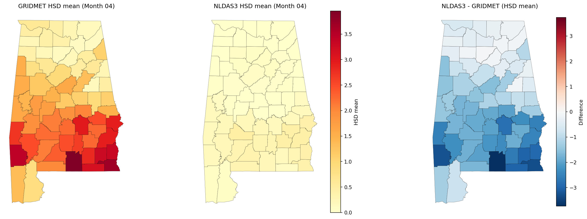

### Month July
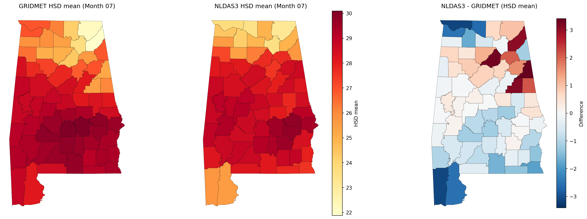

### Month Oct
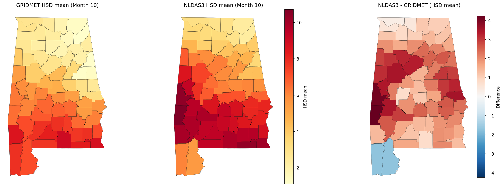

## HSD Distribution Plots

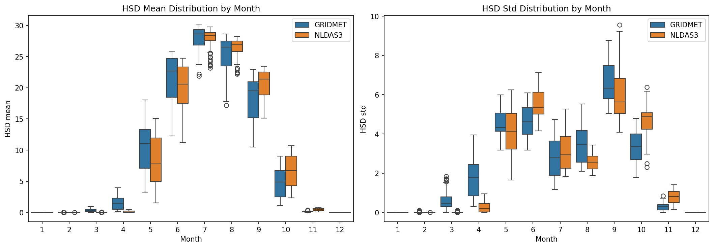
