# Alabama GRIDMET vs NLDAS3 Comparison Report

This report was generated from county-level monthly climatology outputs.

## Correlation Summary

| variable | stat | n_pairs | pearson_r | pearson_p | spearman_rho | spearman_p |
| --- | --- | --- | --- | --- | --- | --- |
| frost_days | mean | 804 | 0.9854493080908996 | 0.0 | 0.9770527216881627 | 0.0 |
| frost_days | std | 804 | 0.9685398201181341 | 0.0 | 0.9724394477407075 | 0.0 |
| gdd | mean | 804 | 0.9964499846476351 | 0.0 | 0.9964354261119392 | 0.0 |
| gdd | std | 804 | 0.8087273197370157 | 4.909903516177681e-187 | 0.8061652782782097 | 5.791854865563331e-185 |
| hsd | mean | 804 | 0.9857798837276889 | 0.0 | 0.9554726983544756 | 0.0 |
| hsd | std | 804 | 0.9039555785028848 | 4.0472608824991285e-298 | 0.9086930078709649 | 1.6922871083912036e-306 |

## FROST_DAYS (mean)

Representative monthly maps:

### Month 01

### Month 04

### Month 07

### Month 10

## FROST_DAYS (std)

Representative monthly maps:

### Month 01
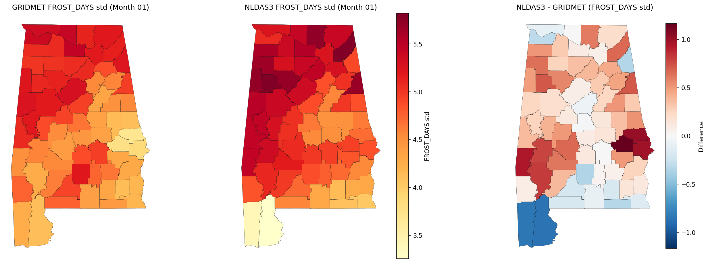

### Month 04
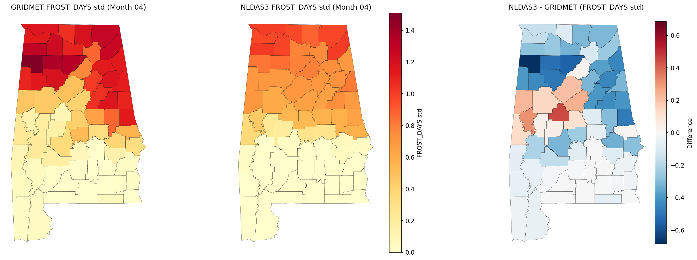

### Month 07
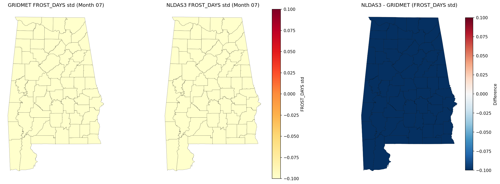

### Month 10
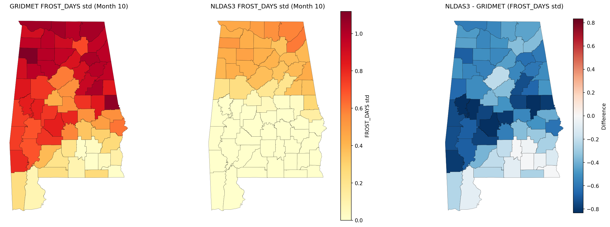

## GDD (mean)

Representative monthly maps:

### Month 01

### Month 04

### Month 07

### Month 10

## GDD (std)

Representative monthly maps:

### Month 01
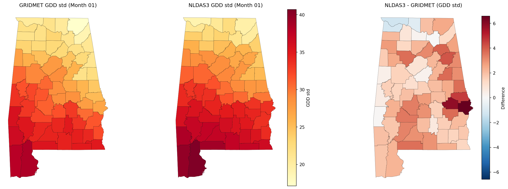

### Month 04
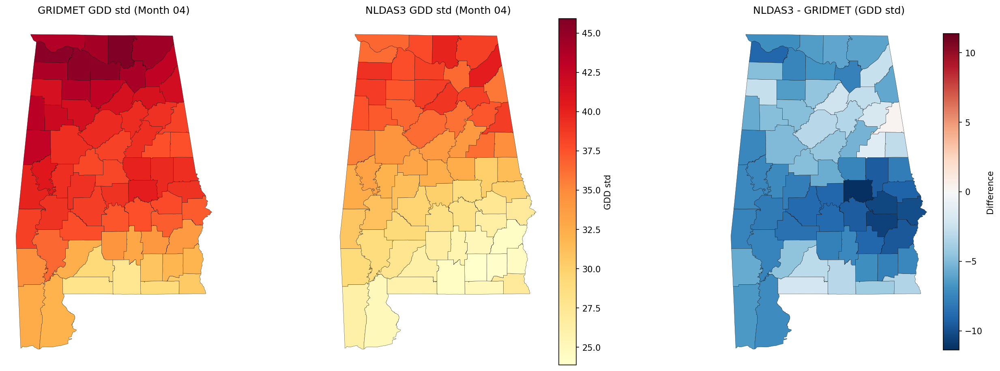

### Month 07
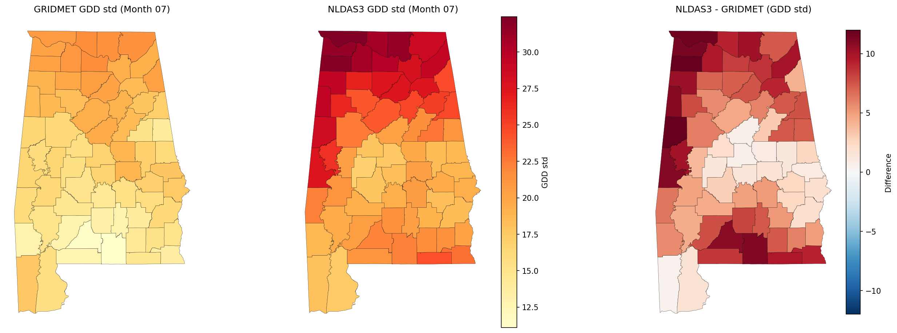

### Month 10
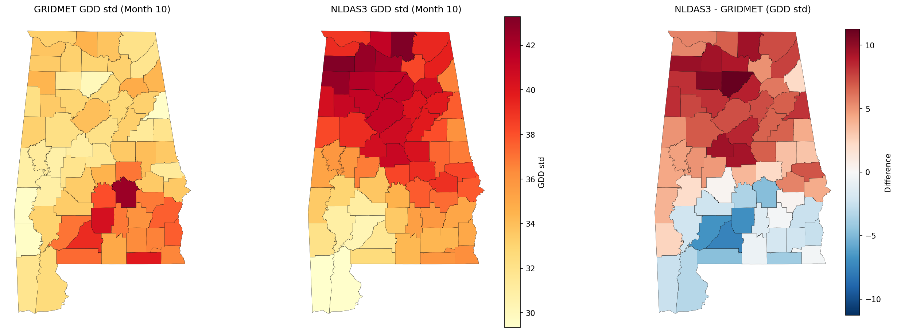

## HSD (mean)

Representative monthly maps:

### Month 01

### Month 04

### Month 07

### Month 10

## HSD (std)

Representative monthly maps:

### Month 01

### Month 04
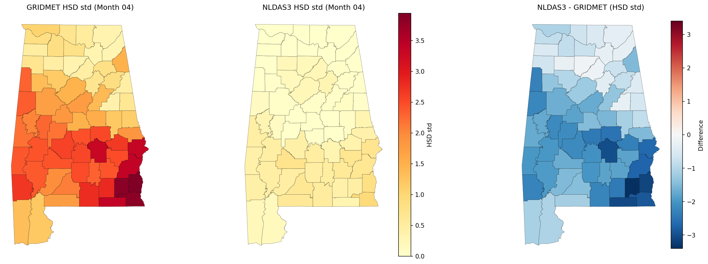

### Month 07
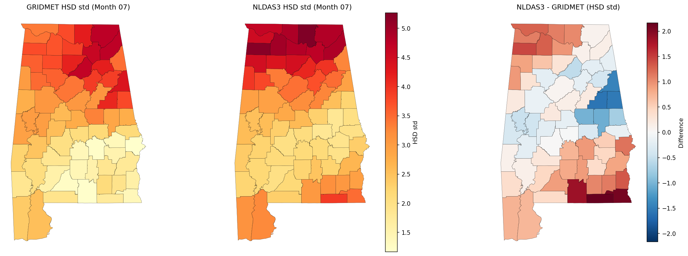

### Month 10
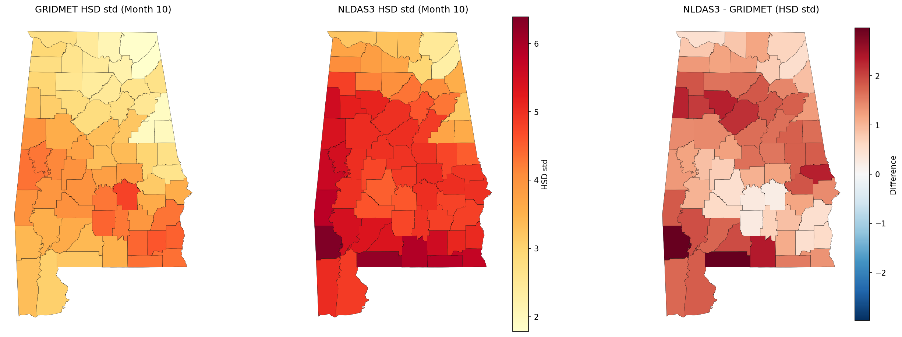

## Output Files

- `maps/`: map PNGs for every month, variable, and stat
- `tables/`: CSVs for county-month values and summaries
